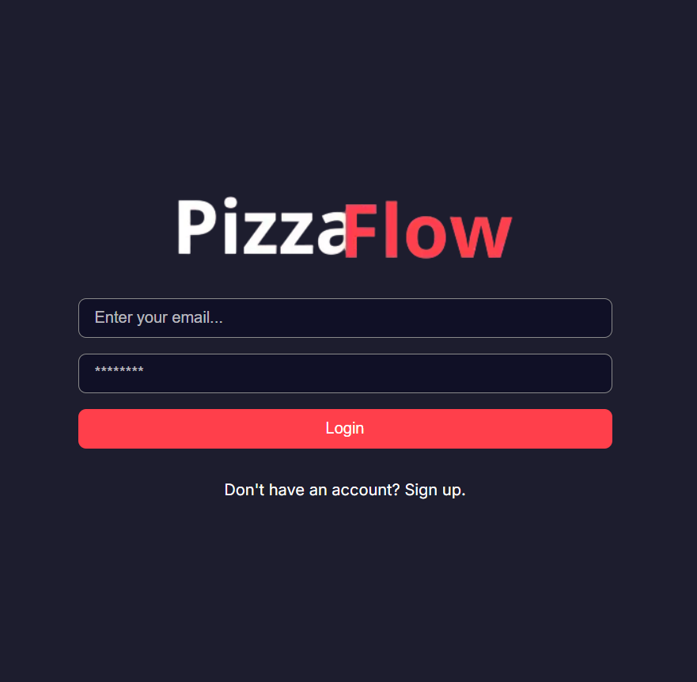
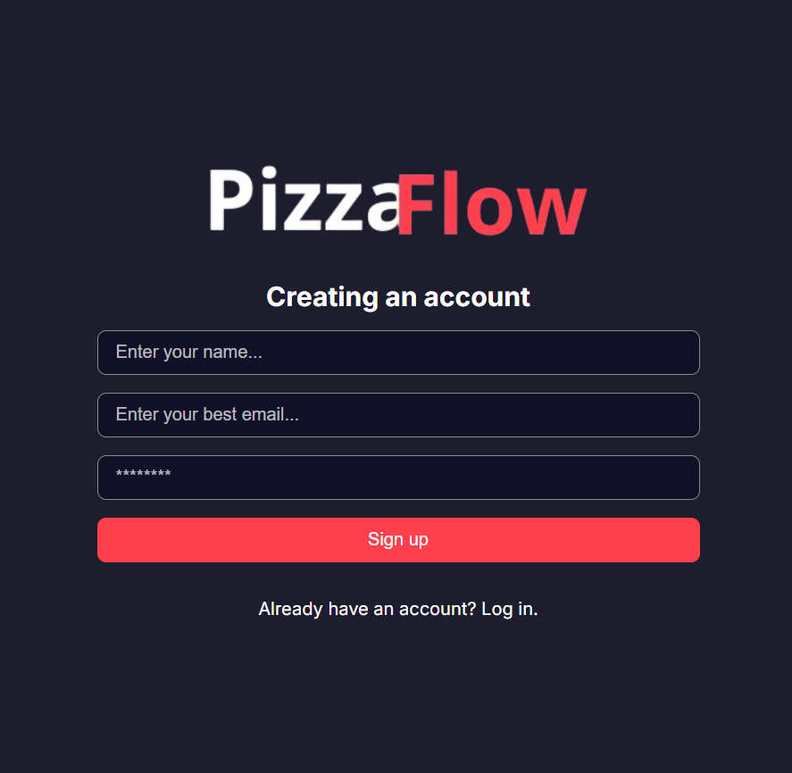
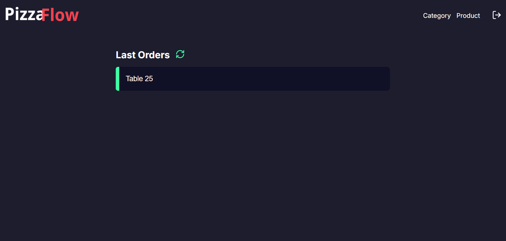
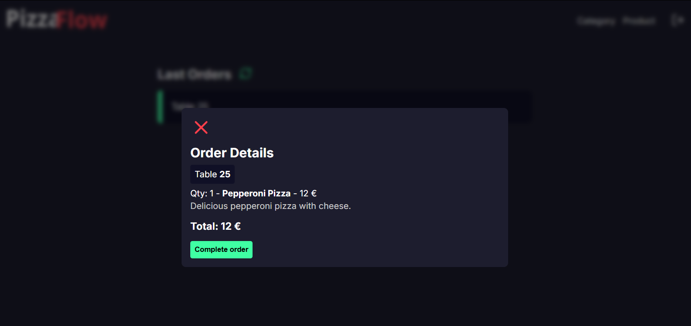
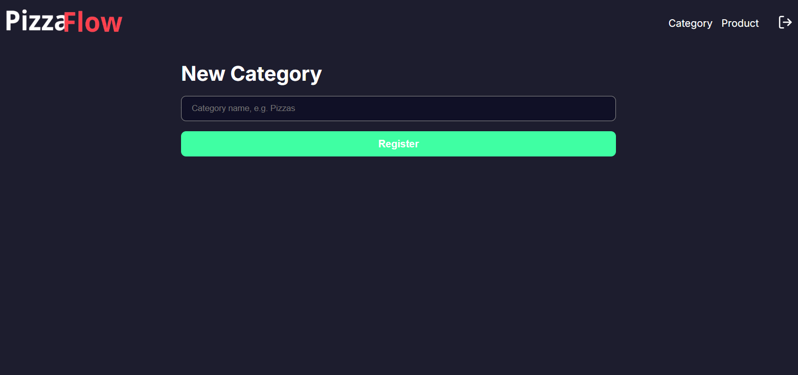
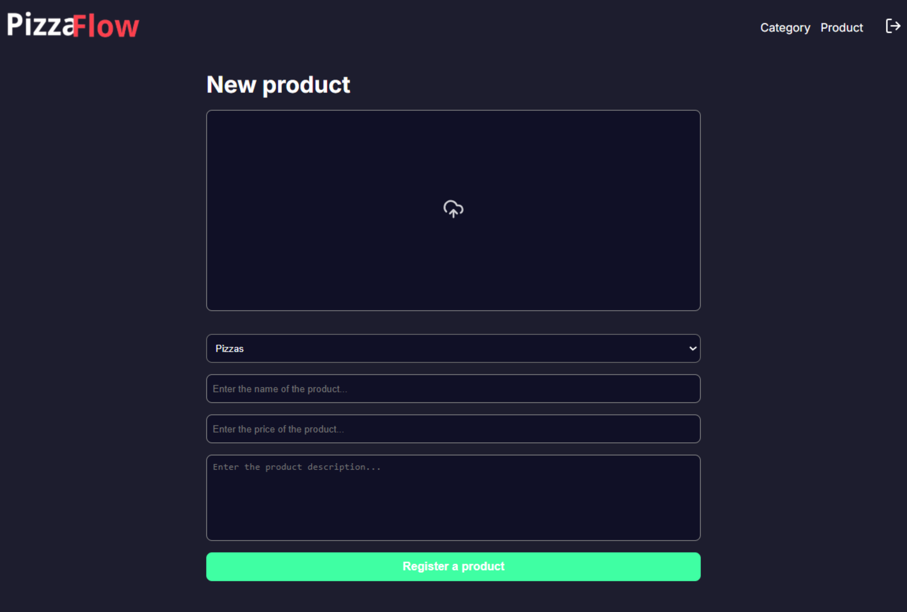

# PizzaFlow — Admin Panel

> Web-based dashboard for restaurant managers to handle menu, categories, and monitor incoming orders in real time.

This is the **Admin Panel** of the PizzaFlow system — a full-stack restaurant management platform split across two environments. This panel runs on **desktop** and is used by the restaurant administration. The companion app ([pizzaflow-mobile](https://github.com/nathalliavieira/pizzaflow-mobile)) runs on **tablet/mobile** and is used by waitstaff and the kitchen.

---
## 📸 Screenshots

| Login | Sign Up |
|-------|---------|
|  |  |

| Dashboard — Last Orders | Order Details |
|------------------------|---------------|
|  |  |

| New Category | New Product |
|--------------|-------------|
|  |  |

---

## ✨ Features

- 🔐 Authentication — sign up and login with JWT
- 🗂️ Category management — create and organize menu categories (e.g. Pizzas, Drinks)
- 🍕 Product management — register products with name, price, description and image upload
- 📋 Order monitoring — real-time dashboard showing incoming orders by table
- ✅ Order completion — view order details and mark orders as complete

---

## 🛠️ Tech Stack


---

## 🔗 Related Repositories

This project is part of the **PizzaFlow** ecosystem:

| Repository | Description | Environment |
|---|---|---|
| **pizzaflow-admin** (this repo) | Admin panel — menu & order management | 🖥️ Desktop |
| [pizzaflow-mobile](https://github.com/nathalliavieira/pizzaflow-mobile) | Waiter & kitchen app — table and order flow | 📱 Tablet / Mobile |

Both share the same backend API.

---

## 🚀 Getting Started

### Prerequisites

- Node.js 18+
- The shared backend API running

### Installation

```bash
# Clone the repository
git clone https://github.com/nathalliavieira/pizzaflow-admin.git
cd pizzaflow-admin

# Install dependencies
npm install

# Set up environment variables
cp copia.env .env.local
# Edit .env.local with your API URL and credentials
```

### Environment Variables

```env
NEXT_PUBLIC_API_URL=your_backend_api_url
```

### Running locally

```bash
npm run dev
```

Open [http://localhost:3000](http://localhost:3000) in your browser.

---

## 🌐 Live Demo

👉 [web-api-pizzaria.vercel.app](https://web-api-pizzaria.vercel.app)
